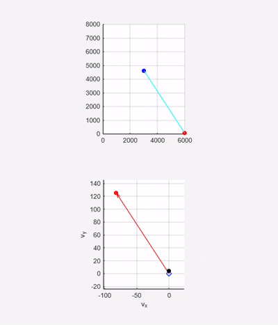

## Simulation Demo

**Autonomous interception of a dynamically maneuvering target using velocity-constrained guidance.  
The robot computes a feasible velocity at each step based on line-of-sight (LOS) and acceleration limits, ensuring convergence and successful capture.**
